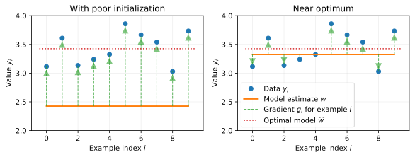

.. _sec-math:

Mathematical underpinnings
==========================

Machine learning and big data go hand-in-hand. Fitting a machine learning model
to this data can be expensive. For example, training OpenAI's popular GPT model
required a process that took "1 month on 8 GPUs" (`source <https://openai.com/blog/language-unsupervised/>`_).

Of course, it'd be convenient to get this results more quickly. But of course,
performing more computation would cost a lot more. On Amazon EC2, using 32 GPUs
for half a month would cost twice as much. Then, one questions is relevant:
**how can model training finish more quickly with same number of floating point
operations?**

Background
----------

These machine learning problems solve minimizations of the form

.. math::

   \widehat{w} = \arg\min_{w} \frac{1}{n}\sum_{i=1}^n f(w; z_i)

where :math:`z_i` is the :math:`i`th example. For example, if the example
:math:`z_i=(y_i, x_i)` for a scalar target variable :math:`y_i` and a feature
vector :math:`x_i`, then :math:`f(w, z_i)` might measure the least squares loss
with :math:`f(w; z_i) = (y_i - x_i^T w)^2`.

Typically, the number of examples :math:`n` is very large. This is challenging
for the optimization underlying machine learning. To help address this issue,
the commonly used machine learning optimizations approximate the gradient with
a small number of examples, aka the "batch size". In the simplest form, these
stochastic optimizations run updates of the form

.. math::

   w_{k+1} = w_k - \gamma_k \sum_{i=1}^B \nabla f(w_k; z_{i_s})

where :math:`\nabla f(w_k; z_{i_s})` is the gradient for model :math:`w_k` with example :math:`i_s` where :math:`i_s` is chosen uniformly at random.

This means the gradient is approximated with a constant number of examples
:math:`B` regardless of how different the gradients are for each example.

Why should the batch size grow?
-------------------------------

Why should the batch size be constant? With poor initialization, the gradients
for each example might point in the same direction. Using one example to
approximate the gradient will suffice if the gradient for each example is
exactly the same (or if :math:`\nabla f(w; z_i) = g` for all :math:`i` and some
vector :math:`g`).

Likewise, let's say the model :math:`w` is close to the optimum. Then the
gradients for each example will point in different directions because the
gradient for each example points to the optimal model for that example (and
presumably all the data are unique).

This is best illustrated with a simple 1D example. Let's perform a simple
minimization for illustration:

.. math::

   \color{red}{\widehat{w}} = \arg\min_{\color{orange}{w}} \sum_{i=1}^{10} \frac{1}{2}(\color{blue}{y_i} - \color{orange}{w})^2

Then the gradient for model :math:`w_k` for each example will be
:math:`\color{green}{g_i = y_i - w_k}`.

These example gradients :math:`\color{green}{g_i}` are pretty similar with poor
initialization: they're all positive, and only differ in magnitude (between
values of 0.5 and 1.5). Near the optimum, they're very different: some
gradients are positive, some are negative and some are approximately zero.

This "gradient diversity" can be shown to increase in higher dimensions for
various function classes. Gradient diversity measures the orthogonality between
the gradients for each example [2]_. Complete details of how this grows
can be found in Section 4.1 of Sievert et.  al [1]_.

How should the batch size grow?
-------------------------------

For neural networks, a method that geometrically increases the batch size as a
function of epochs has shown really good performance. [3]_

If you have a strongly convex problem, it should grow geometrically with the
number of model updates (not epochs). [4]_

.. [1] "Improving the convergence of SGD with adaptive batch
   sizes".  Scott Sievert and Zachary Charles. 2019.
   https://arxiv.org/abs/1910.08222

.. [2] "Gradient Diversity: a Key Ingredient for Scalable Distributed
   Learning". D Yin, A Pananjady, M Lam, D Papailiopoulos, K Ramchandran, P
   Bartlett. 2018. https://arxiv.org/abs/1706.05699

.. [3] "Don't Decay the Learning Rate, Increase the Batch Size". Samuel L.
       Smith, Pieter-Jan Kindermans, Chris Ying, and Quoc V. Le. 2017.
       https://arxiv.org/abs/1711.00489

.. [4] Chapter 5 of "Optimization methods for large-scale machine learning."
   Bottou, Leon and Curtis, Frank E and Nocedal, Jorge. 2018. https://arxiv.org/abs/1606.04838
